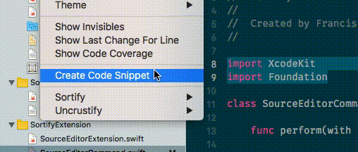

# Sortify
#### Xcode Source Editor Extension for Sorting Lines

<div align="center">
  
</div>

This was built as a prototype to test Xcode Extensions.

## Installation

### Build

Using `Xcode 9+`
1. Download the source code.
2. Open the Sortify.xcodeproj and run the _SortifyExtension_ target, choosing Xcode as the host application.

This is a **temporary installation** as it will only work when running the project.

### Zip

1. Download the [latest release](https://github.com/FranciscoAmado/Sortify/releases) `Sortify.zip`
2. Open the `Sortify.app`, which will add the Extension to Xcode.
3. (Optional) Move the `Sortify.app` to the `Applications` folder.
4. Enable the Extension in `System Preferences >> Extensions`

## Usage

1. Select the lines that will be sorted in the open file
2. Xcode >> Editor >> Sortify >> **Sort Selected Lines**

*Pro tip!* - You can add a keyboard shortcut to sort the lines via `System Preferences >> Keyboard >> Shortcuts >> App Shortcuts`.
The command below adds this shortcut for you, for the shortcut `ctrl + shift + i` on Xcode:

```
defaults write com.github.atom NSUserKeyEquivalents -dict-add "Sort Selected Lines" "^\$i"
```



## Known issues

* Simple text sorting
* ~~Text needs to be aligned to work properly~~

## TODO

- [ ] Maybe add `import` sorting

## Acknowledgments

App Icon Arrow made by <a href="https://www.flaticon.com/authors/dave-gandy" title="Dave Gandy">Dave Gandy</a> is licensed by <a href="http://creativecommons.org/licenses/by/3.0/" title="Creative Commons BY 3.0" target="_blank">CC 3.0 BY</a>

All the rest is free.

## Contributing

Open an [issue](https://github.com/FranciscoAmado/Sortify/issues/new) or a [Pull Request](https://github.com/FranciscoAmado/Sortify/compare). All help is appreciated.
